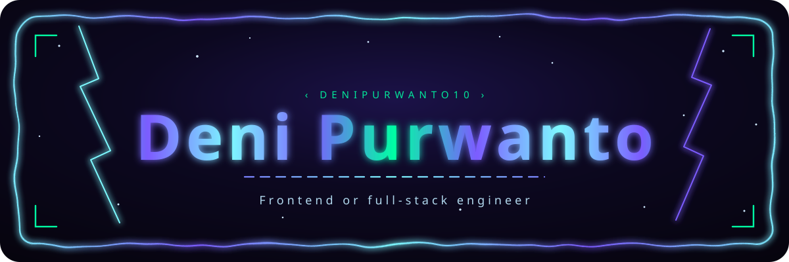

## 🚀 About Me
 

- 🎓 Bachelor of Informatics Engineering – Universitas Langlangbuana  
- 💡 Passionate about **Web Development** and **Mobile Development**
- 🌍 Based in **Bandung, Indonesia**
- 🔐 Concerned with **secure, scalable, and maintainable** code  

## 🛠️ Skills

  
  
  
  
  
  
  
  
  
  
  
  
  
  
  
  
  
  
  
  
  
  
  
  
  
  
  
  
  
  
  
  
  
  
  
  

## 🏆 GitHub Trophies

<a href="https://github.com/denipurwanto10">
  <picture>
    <source
      media="(prefers-color-scheme: dark)"
      srcset="https://github-profile-trophy-ruddy.vercel.app/?username=denipurwanto10&theme=tokyonight&rank=-?&title=-Followers,-PullRequestFirst,-Pull2pt,-PullRequest"
    >
    <source
      media="(prefers-color-scheme: light)"
      srcset="https://github-profile-trophy-ruddy.vercel.app/?username=denipurwanto10&theme=tokyonight&rank=-?&title=-Followers,-PullRequestFirst,-Pull2pt,-PullRequest"
    >
    
  </picture>
</a>

 

  

 

  

  <em>“Strive for progress, not perfection.”</em>

